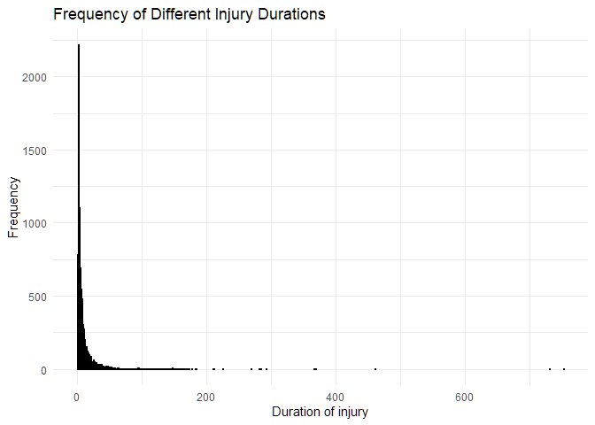
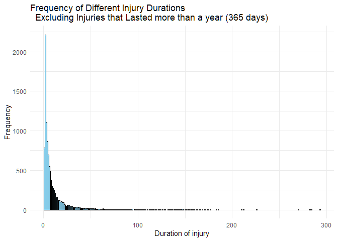
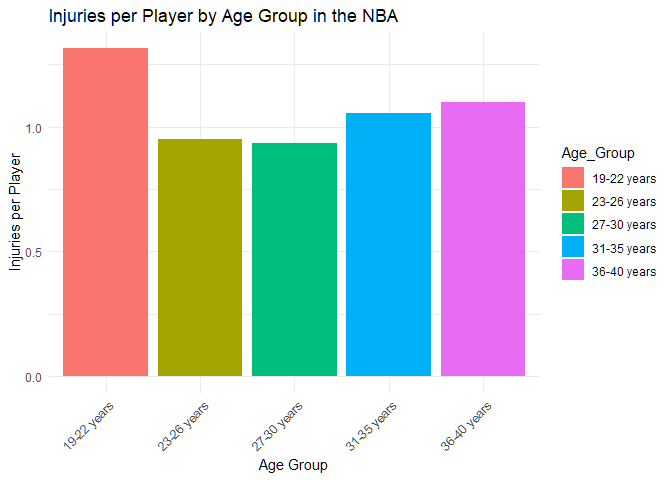
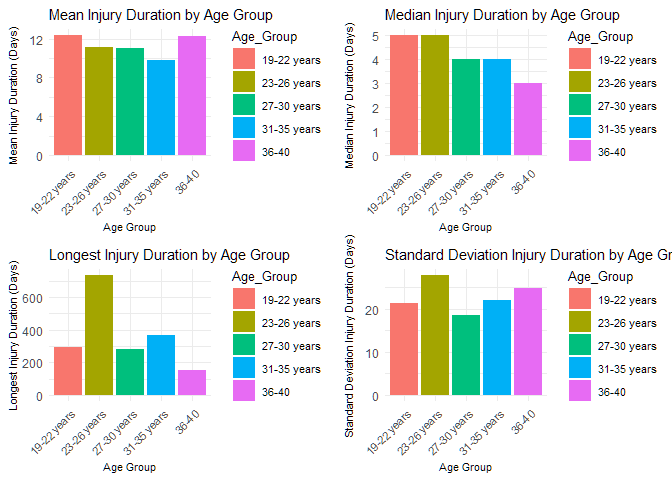
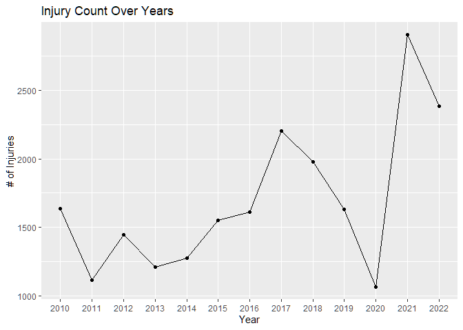

DS 202 Final Project Data Dynamos
================
Logan Becker, Gavin Herum, Jackson Weaver

## View Data Set

``` r
#install.packages("readr")
library(readr)
# read datasets
injury_data <- read_csv("./injury_data.zip") 
player_data <- read_csv("./player_data.csv")
seasonsStats_data <- read_csv("./Seasons_Stats.csv")
head(injury_data)
```

    ## # A tibble: 6 × 6
    ##    ...1 Date       Team    Acquired     Relinquished  Notes                     
    ##   <dbl> <date>     <chr>   <chr>        <chr>         <chr>                     
    ## 1     0 1951-12-25 Bullets <NA>         Don Barksdale placed on IL              
    ## 2     1 1952-12-26 Knicks  <NA>         Max Zaslofsky placed on IL with torn si…
    ## 3     2 1956-12-29 Knicks  <NA>         Jim Baechtold placed on inactive list   
    ## 4     3 1959-01-16 Lakers  <NA>         Elgin Baylor  player refused to play af…
    ## 5     4 1961-11-26 Lakers  <NA>         Elgin Baylor  player reported for milit…
    ## 6     5 1962-03-24 Lakers  Elgin Baylor <NA>          player given 2-day pass f…

``` r
head(player_data)
```

    ## # A tibble: 6 × 8
    ##   name             year_start year_end position height weight birth_date college
    ##   <chr>                 <dbl>    <dbl> <chr>    <chr>   <dbl> <chr>      <chr>  
    ## 1 Alaa Abdelnaby         1991     1995 F-C      6-10      240 June 24, … Duke U…
    ## 2 Zaid Abdul-Aziz        1969     1978 C-F      6-9       235 April 7, … Iowa S…
    ## 3 Kareem Abdul-Ja…       1970     1989 C        7-2       225 April 16,… Univer…
    ## 4 Mahmoud Abdul-R…       1991     2001 G        6-1       162 March 9, … Louisi…
    ## 5 Tariq Abdul-Wah…       1998     2003 F        6-6       223 November … San Jo…
    ## 6 Shareef Abdur-R…       1997     2008 F        6-9       225 December … Univer…

``` r
head(seasonsStats_data)
```

    ## # A tibble: 6 × 53
    ##    ...1  Year Player      Pos     Age Tm        G    GS    MP   PER `TS%` `3PAr`
    ##   <dbl> <dbl> <chr>       <chr> <dbl> <chr> <dbl> <dbl> <dbl> <dbl> <dbl>  <dbl>
    ## 1     0  1950 Curly Arms… G-F      31 FTW      63    NA    NA    NA 0.368     NA
    ## 2     1  1950 Cliff Bark… SG       29 INO      49    NA    NA    NA 0.435     NA
    ## 3     2  1950 Leo Barnho… SF       25 CHS      67    NA    NA    NA 0.394     NA
    ## 4     3  1950 Ed Bartels  F        24 TOT      15    NA    NA    NA 0.312     NA
    ## 5     4  1950 Ed Bartels  F        24 DNN      13    NA    NA    NA 0.308     NA
    ## 6     5  1950 Ed Bartels  F        24 NYK       2    NA    NA    NA 0.376     NA
    ## # ℹ 41 more variables: FTr <dbl>, `ORB%` <dbl>, `DRB%` <dbl>, `TRB%` <dbl>,
    ## #   `AST%` <dbl>, `STL%` <dbl>, `BLK%` <dbl>, `TOV%` <dbl>, `USG%` <dbl>,
    ## #   blanl <lgl>, OWS <dbl>, DWS <dbl>, WS <dbl>, `WS/48` <dbl>, blank2 <lgl>,
    ## #   OBPM <dbl>, DBPM <dbl>, BPM <dbl>, VORP <dbl>, FG <dbl>, FGA <dbl>,
    ## #   `FG%` <dbl>, `3P` <dbl>, `3PA` <dbl>, `3P%` <dbl>, `2P` <dbl>, `2PA` <dbl>,
    ## #   `2P%` <dbl>, `eFG%` <dbl>, FT <dbl>, FTA <dbl>, `FT%` <dbl>, ORB <dbl>,
    ## #   DRB <dbl>, TRB <dbl>, AST <dbl>, STL <dbl>, BLK <dbl>, TOV <dbl>, …

## Filter every dataset to be all years beyond (inclusive) 2010

``` r
# Filter injury_data
filtered_injurydata <- injury_data[as.numeric(format(injury_data$Date, "%Y")) >= 2010,]
print(paste('injury_data'))
```

    ## [1] "injury_data"

``` r
summary(filtered_injurydata["Date"])
```

    ##       Date           
    ##  Min.   :2010-01-01  
    ##  1st Qu.:2014-03-03  
    ##  Median :2017-11-19  
    ##  Mean   :2017-05-24  
    ##  3rd Qu.:2021-02-21  
    ##  Max.   :2023-04-16

``` r
# Filter player_data
filtered_playerdata <- subset(player_data, year_start >= 2010 | year_end >= 2010)
print('player_data')
```

    ## [1] "player_data"

``` r
summary(filtered_playerdata[c("year_start", "year_end")])
```

    ##    year_start      year_end   
    ##  Min.   :1993   Min.   :2010  
    ##  1st Qu.:2007   1st Qu.:2014  
    ##  Median :2012   Median :2017  
    ##  Mean   :2011   Mean   :2016  
    ##  3rd Qu.:2015   3rd Qu.:2018  
    ##  Max.   :2018   Max.   :2018

``` r
# Filter seasons_stats
filtered_seasonsStatsdata <- subset(seasonsStats_data, Year >= 2010)
print('seasonsStats_data')
```

    ## [1] "seasonsStats_data"

``` r
summary(filtered_seasonsStatsdata["Year"])
```

    ##       Year     
    ##  Min.   :2010  
    ##  1st Qu.:2011  
    ##  Median :2014  
    ##  Mean   :2014  
    ##  3rd Qu.:2015  
    ##  Max.   :2017

## Change old team names to their new team name

``` r
all_teams <- unique(filtered_injurydata$Team)
all_teams
```

    ##  [1] "Knicks"       "Celtics"      "Nets"         "Wizards"      "Blazers"     
    ##  [6] "Clippers"     "Heat"         "76ers"        "Mavericks"    "Pacers"      
    ## [11] "Raptors"      "Cavaliers"    "Jazz"         "Nuggets"      "Timberwolves"
    ## [16] "Grizzlies"    "Magic"        "Spurs"        "Bucks"        "Pistons"     
    ## [21] "Kings"        "Lakers"       "Hawks"        "Rockets"      "Thunder"     
    ## [26] "Warriors"     "Hornets"      "Suns"         "Bulls"        "Bobcats"     
    ## [31] "Pelicans"     "Bullets"

``` r
# We see there is 32 teams here, there should only be 30 nba teams. Bullets and Bobcats are old names, let's change those to be correct
# Hornets <- Bobcats
# Wizards <- Bullets

filtered_injurydata$Team <- 
  ifelse(filtered_injurydata$Team == "Bobcats", "Hornets",
  ifelse(filtered_injurydata$Team == "Bullets", "Wizards",
         filtered_injurydata$Team))
# Check if there is now 30 teams
all_teams <- unique(filtered_injurydata$Team)
all_teams
```

    ##  [1] "Knicks"       "Celtics"      "Nets"         "Wizards"      "Blazers"     
    ##  [6] "Clippers"     "Heat"         "76ers"        "Mavericks"    "Pacers"      
    ## [11] "Raptors"      "Cavaliers"    "Jazz"         "Nuggets"      "Timberwolves"
    ## [16] "Grizzlies"    "Magic"        "Spurs"        "Bucks"        "Pistons"     
    ## [21] "Kings"        "Lakers"       "Hawks"        "Rockets"      "Thunder"     
    ## [26] "Warriors"     "Hornets"      "Suns"         "Bulls"        "Pelicans"

## Lets find out the average duration of an injury

``` r
library(magrittr)
library(dplyr)
library(ggplot2)

# Create subset of the end of an injury
Acquired_subset <- subset(filtered_injurydata, is.na(filtered_injurydata$Relinquished))
Acquired_subset <- subset( Acquired_subset, select = -c(1, Relinquished) )

# Create subset of the begining of an injury
Relinquished_subset <- subset(filtered_injurydata, is.na(filtered_injurydata$Acquired))
Relinquished_subset <- subset( Relinquished_subset, select = -c(1, Acquired) )


# Merge the dataset with itself based on the player's name
merged_data <- merge(x = Acquired_subset, y = Relinquished_subset, by.x = "Acquired", by.y = "Relinquished", suffixes = c("_end", "_begin"))

merged_data$Date_gap <- as.numeric(difftime(merged_data$Date_end, merged_data$Date_begin, units = "days"))

# Removing all Date_gaps less than 0
merged_data <- subset(merged_data, Date_gap > 0 )

# Filtering to ensure no duplicate Date_end for a given Date_begin
injury_duration <- merged_data %>% 
  group_by(Acquired, Date_end)  %>% 
  filter(Date_gap == min(Date_gap))

# Reordering collumns of data
injury_duration <- injury_duration[, c("Acquired", "Date_begin", "Date_end", "Date_gap", "Team_begin", "Team_end", "Notes_begin", "Notes_end")]

# Rename column to Player
colnames(injury_duration)[colnames(injury_duration) == "Acquired"] <- 'Player'

Injury_duration_average <- mean(injury_duration$Date_gap)
Injury_duration_average
```

    ## [1] 13.84776

``` r
# This graph is messed up because Patty Mills had an injury that lasted for 2976 days
ggplot(injury_duration, aes(x = Date_gap)) +
  geom_bar(fill = "skyblue", color = "black") +
  labs(title = "Frequency of Different Injury Durations",
       x = "Duration of injury",
       y = "Frequency") +
  theme_minimal()
```

<!-- -->

``` r
# This graph is a zoomed in version of only the injuries that lasted less than a year
ggplot(subset(injury_duration, Date_gap < 365 ), aes(x = Date_gap)) +
  geom_bar(fill = "skyblue", color = "black") +
  labs(title = 
  "Frequency of Different Injury Durations
  Excluding Injuries that Lasted more than a year (365 days)",
       x = "Duration of injury",
       y = "Frequency") +
  theme_minimal()
```

<!-- -->

Based off of this data the average duration of an injury will be 13.85
days.

## Injury per Player data setup

``` r
library(dplyr)
library(lubridate)
#change injurydata date column to just the year instead of date format to help merge
changed_injurydata <- filtered_injurydata
changed_injurydata$Date <- as.Date(changed_injurydata$Date)
changed_injurydata$Date <- year(changed_injurydata$Date)

# merge datasets and combine player info and injured player
ageVSinjury <- inner_join(changed_injurydata, filtered_seasonsStatsdata, 
                         by = c("Relinquished" = "Player", "Date" = "Year"),
                         relationship = "many-to-many")

# make sure there are no repeats (distinct IDs)
ageVSinjury <- distinct(ageVSinjury,...1.x, .keep_all = TRUE)
```

## Injuries per Player (2010 - 2017)

``` r
# First look at age range
age_range <- summary(filtered_seasonsStatsdata$Age)
age_range 
```

    ##    Min. 1st Qu.  Median    Mean 3rd Qu.    Max. 
    ##   19.00   23.00   26.00   26.61   29.00   40.00

``` r
# Age range is 19-40, lets split into groups by 3-4

# With this knowledge we can make a function to split up a dataset into a list with different age groups
SplitAges <- function(df) {
  age1 <- subset(df, Age <= 22)
  age2 <- subset(df, Age <= 26 & Age > 22)
  age3 <- subset(df, Age <= 30 & Age > 26)
  age4 <- subset(df, Age <= 35 & Age > 30)
  age5 <- subset(df, Age > 35)
  return(list(age1 = age1,age2 = age2,age3 = age3,age4 = age4,age5 = age5)) #Returns list of 5 lists of age groups
}
# Split age range by calling function
ageInjury_list <- SplitAges(ageVSinjury["Age"])
agePlayer_list <- SplitAges(filtered_seasonsStatsdata["Age"])

# Function to print/save age ratios for each group
AgeRatios <- function(list1,list2,PRINT) {
  if(PRINT == TRUE) {
    print(paste("19-22 years ratio:", nrow(list1[[1]]) / nrow(list2[[1]])))
    print(paste("23-26 years ratio:", nrow(list1[[2]]) / nrow(list2[[2]])))
    print(paste("27-30 years ratio:", nrow(list1[[3]]) / nrow(list2[[3]])))
    print(paste("31-35 years ratio:", nrow(list1[[4]]) / nrow(list2[[4]])))
    print(paste("36-40 years ratio:", nrow(list1[[5]]) / nrow(list2[[5]])))
  } else {
    ratio1 <- nrow(list1[[1]]) / nrow(list2[[1]])
    ratio2 <- nrow(list1[[2]]) / nrow(list2[[2]])
    ratio3 <- nrow(list1[[3]]) / nrow(list2[[3]])
    ratio4 <- nrow(list1[[4]]) / nrow(list2[[4]])
    ratio5 <- nrow(list1[[5]]) / nrow(list2[[5]])
    return(list("19-22 years" = ratio1,"23-26 years" = ratio2,"27-30 years" = ratio3,"31-35 years" = ratio4,"36-40 years" = ratio5))
  }
}

# Print out ratios of injured players vs all players for each age range
AgeRatios(ageInjury_list, agePlayer_list, TRUE) # PRINTS AGE RATIOS
```

    ## [1] "19-22 years ratio: 1.3134328358209"
    ## [1] "23-26 years ratio: 0.952431289640592"
    ## [1] "27-30 years ratio: 0.933817594834544"
    ## [1] "31-35 years ratio: 1.05459387483356"
    ## [1] "36-40 years ratio: 1.0979020979021"

``` r
listAgeRatios <- AgeRatios(ageInjury_list, agePlayer_list, FALSE) # SAVES AGE RATIOS AS LIST
```

## Graph for Injuries per player

``` r
library(ggplot2)
# Convert ratios to data frame
dfAgeRatio <- data.frame(Age_Group = names(listAgeRatios), Ratio = unlist(listAgeRatios), row.names = NULL)
dfAgeRatio
```

    ##     Age_Group     Ratio
    ## 1 19-22 years 1.3134328
    ## 2 23-26 years 0.9524313
    ## 3 27-30 years 0.9338176
    ## 4 31-35 years 1.0545939
    ## 5 36-40 years 1.0979021

``` r
# Create graph to display Age vs Injury data
ggplot(dfAgeRatio, aes(x = Age_Group, y = Ratio, fill = Age_Group)) +
  geom_bar(stat = "identity") +
  labs(title = "Injuries per Player by Age Group in the NBA", x = "Age Group", y = "Injuries per Player") +
  theme_minimal() +
  theme(axis.text.x = element_text(angle = 45, hjust = 1))
```

<!-- --> This graph
was created to visualize the difference in injuries per age group. The
injuries per player above 1 mean there is more occurrences of players
getting injured then there is players in the league. So this means there
are players getting injured multiple times or having reoccurring
injuries. We also can see from the graph that the most injuries are
occurring when players are young and/or just entering the NBA. We also
see older players getting injured highly as expected.

## Statistics for injury duration by age group

``` r
library(lubridate)
# Change date column to just year
changed_injuryduration <- injury_duration
changed_injuryduration$Date_begin <- as.Date(changed_injuryduration$Date_begin)
changed_injuryduration$Date_begin <- year(changed_injuryduration$Date_begin)

# Merge injury_duration and filtered_seasonsStatsdata
durationANDage <- inner_join(changed_injuryduration, filtered_seasonsStatsdata, 
                             by = c("Date_begin" = "Year", "Player" = "Player"),
                             relationship = "many-to-many")
# Split by age group
ageInjuryDuration_list <- SplitAges(durationANDage[c("Date_gap", "Age")])

# Statistics for each age group
statisticCalculations <- function(df, fun) {
  fun1 <- fun(df[[1]]$Date_gap)
  fun2 <- fun(df[[2]]$Date_gap)
  fun3 <- fun(df[[3]]$Date_gap)
  fun4 <- fun(df[[4]]$Date_gap)
  fun5 <- fun(df[[5]]$Date_gap)
  return(list("19-22 years" = fun1, "23-26 years" = fun2, "27-30 years" = fun3, "31-35 years" = fun4, "36-40" = fun5))
}
# Get lists for each age group for means, maxs, medians, sds
meanDurations <- statisticCalculations(ageInjuryDuration_list, mean)
maxDurations <- statisticCalculations(ageInjuryDuration_list, max)
medianDurations <- statisticCalculations(ageInjuryDuration_list, median)
sdDurations <- statisticCalculations(ageInjuryDuration_list, sd)
```

## Graph Injury duration by age group

``` r
#install.packages('cowplot')
library(cowplot)
```

    ## Warning: package 'cowplot' was built under R version 4.3.3

``` r
library(ggplot2)
# Create datasets for the statistics for graph building
mean_df <- data.frame(Age_Group = names(meanDurations), Mean = unlist(meanDurations))
max_df <- data.frame(Age_Group = names(maxDurations), Max = unlist(maxDurations))
median_df <- data.frame(Age_Group = names(medianDurations), Median = unlist(medianDurations))
sd_df <- data.frame(Age_Group = names(sdDurations), SD = unlist(sdDurations))


statistic_barplot <- function(data, x, y, fill, title, y_label) {
  plot <- ggplot(data, aes_string(x = x, y = y, fill = fill)) +
    geom_bar(stat = "identity") +
    labs(title = title, x = "Age Group", y = y_label) +
    theme_minimal() +
    theme(axis.text.x = element_text(angle = 45, hjust = 1, size = 8),
          plot.title = element_text(size = 11),
          axis.title = element_text(size = 8),
          legend.text=element_text(size=8),
          legend.title = element_text(size = 10))
  return(plot)
}
# Create barcharts for Mean, Max, Median,  by age group
bar_means <- statistic_barplot(mean_df, "Age_Group", "Mean", "Age_Group", "Mean Injury Duration by Age Group", "Mean Injury Duration (Days)")
```

    ## Warning: `aes_string()` was deprecated in ggplot2 3.0.0.
    ## ℹ Please use tidy evaluation idioms with `aes()`.
    ## ℹ See also `vignette("ggplot2-in-packages")` for more information.
    ## This warning is displayed once every 8 hours.
    ## Call `lifecycle::last_lifecycle_warnings()` to see where this warning was
    ## generated.

``` r
bar_maxs <- statistic_barplot(max_df, "Age_Group", "Max", "Age_Group", "Longest Injury Duration by Age Group", "Longest Injury Duration (Days)")
bar_medians <- statistic_barplot(median_df, "Age_Group", "Median", "Age_Group", "Median Injury Duration by Age Group", "Median Injury Duration (Days)")
bar_sd <- statistic_barplot(sd_df, "Age_Group", "SD", "Age_Group", "Standard Deviation Injury Duration by Age Group", "Standard Deviation Injury Duration (Days)")

plot_grid(bar_means, bar_medians, bar_maxs, bar_sd, ncol = 2, nrow = 2, align = "v")
```

<!-- -->

We created these graphs to visualize some statistics of the players’
injury duration by age group to see if we can find any trends. Looking
at the 36-40 year age group we see it has the highest mean, lowest
median, longest injury duration, and highest standard deviation. From
this we can conclude the data is very spread out, more specifically
skewed right. This means while on average there may be older players
recovering quickly from injuries, there is also a significant proportion
of players who experience longer recovery times. This trend is shown for
all age groups (mean \> median) which tells us in all age groups there
are some injuries that are extremely long to recover from. This trend is
mostly profound in the 36-40 year old age group.

## Look at injuries over time 2010 - 2022

``` r
library(ggplot2)
#change injurydata date column to just the year instead of date format to help merge
changed_injurydata <- filtered_injurydata
changed_injurydata$Date <- as.Date(changed_injurydata$Date)
changed_injurydata$Date <- year(changed_injurydata$Date)

# Prepare data (create dataset with each year and amount of injuries)
injuryOverTime <- data.frame(
  Year = unique(changed_injurydata$Date),
  Injuries = sapply(unique(changed_injurydata$Date), function(year) {
    sum(changed_injurydata$Date == year)
  })
)
# Exclude year 2023
injuryOverTime <- subset(injuryOverTime, Year != 2023)

# Convert Year column to factor with ordered levels
injuryOverTime$Year <- factor(injuryOverTime$Year, levels = unique(injuryOverTime$Year))

# Create a line plot using ggplot2
ggplot(injuryOverTime, aes(x = Year, y = Injuries, group = 1)) +
  geom_point() +
  geom_line() +  # Add points for each data point
  labs(x = "Year", y = "# of Injuries", title = "Injury Count Over Years") +
  scale_x_discrete(labels = as.character(injuryOverTime$Year))
```

<!-- -->

We created a line and dot plot to see any trends between injuries and
years. This helps us visualize if injury prevention has gotten better,
worse, or stayed the same. We see an upward trend for the most part as
we go through the years. We also see some spike ups and downs, let’s
dive into those further individually one at a time.

2020 was the year of the pandemic outbreak. This caused the season to be
suspended and have restrictions on playing. This caused less games which
means less oppurtunities to get injured. There was an effort to bring
back nba games with the bubble inviting 22 teams to play basketball
games through rigorous testing and caution. Keep in mind for later that
some players and teams did not get involved with this bubble season.
After this year we see an outbreak of injuries instead of sickness.

In 2021 there could be many causes for the injury outbreak. Some could
be the abrupt start back to intense play and the shortened off season.
The 2020-2021 season started December 22, 2020, so most of this season
is played through 2021. The bubble from the 2019-2020 season had many
factors on the injury outbreak in 2021. This caused some players who
played in it to have a shortened off season and caused the players who
didn’t play, a long time off of intense activity. The bubble season was
very condensed and could have overworked the players. Leading into a
short off season did not give them enough time to recover and get ready
for the next season. For the players who didn’t play this might have
been too long of time off, so when play started again the players might
have overworked their body that stopped being used to this intense
activity.

We see a good increase of injuries in 2017. This could be caused by the
increased pace of the game. In the 2017-2018 there were many timeout
changes made to the rulebook. The main focus of these changes were
increasing the pace of the game. Instead of some 90 second timeouts and
some 60 second timeouts, all timeouts will be 75 seconds flat. Through
this and other changes to mandatory timeouts and stricter delay of game
policies if you go over the time, players saw shorter breaks and more
time in the game without a break, especially in the last few minutes of
a game which sometimes can be the most intense on your body.
